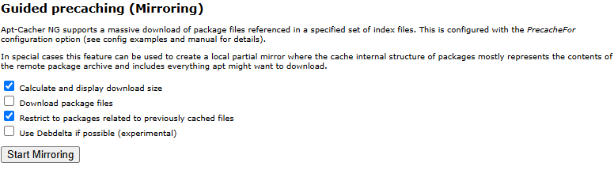

#  APT Cacher NG - About and over view of the 

## Overview of APT cacher NG
APT-Cacher-NG is designed to cache Ubuntu, Debian and other Linux distrobutions and packages locally.  When one of your machines updates, those updates are stored here.  The next machine that is the same or similar can pull from the cache locally, instead of going out to the internet again. 

## My Pupose & Goals
1. Quite honestly, my main purpose was becasue it seemed like fun to do.
2. It does speed up package downloads, but my internet is good, that really isnt a big deal for me.
3. We are helping Linux, being a good steward of the internet.  If we all do this, that will be less download bandwidth on these distro's.  That will allow them to designate resources elsewhere than handling all the requests.


[ANCHOR LINK TEST - UPDATE OR DELETE](https://vscode.dev/github/TheColetrain/thecoletrain.github.io/blob/main/_posts/draft-2025-03-17-APT-Cacher-NG.md#L24)

## Reccomendation.  Should you do this on your server? 
### Short answer is YES! (If you know "you are doing this" and need a guide, skip over the rest of this section and get to the "How To area".)
- I will guide you through a "basic" method, this method will have you set up and running in minutes!  Roughly only a few *copy pasta* steps to get APT Casher NG running!  The basic method is so easy, even I can do it. So for the time spent to get anything done is a WIN.  Amount Cached / Time Spent = Winner Winner Chicken dinner.
- I will also then advise of the advanced options and "tweeks" if you want to mess with it further.  If you want it to be as efficient as possible.
### The long answer is maybe...
- **Phase 1** If you do the short initial version that I will propose, your cache percentages will not be that significant.  (My personal data will be far below)  i.e. you won't cache everything. The tradeoff is how EASY this first version is.  So, you can set up a LXC that caches using scripts and copy/paste in minutes, and if it caches anything at all... that's a win!  The LXC will take very little resources and not that much storage, and you lost little time.... = win.
- **Phase 2** If you go to the next phase, you can precache a little more, wont take any more CPU or RAM, but it will take a couple Gig's of storage.  Not that much harder.  Once more, pretty easy, copy/paste, and press a GUI button.
- **Phase 3** Phase three gets a little tricky.  This is where you are "going for it"  Trying to cache everything under the sun and satisfy all of your obsessive compulsive desires. I tried this level and got sick of it, turned it off.  This involves having updates fail, and then going in to the settings and updating them to resolve.  Quite honestly, I dont much know what I am doing, perhaps someone with a little knowlege would say *"It's so easy, you dont know what you are talking about,"* and they would be Right!
### This wont cache HTTPS, it will only cache HTTP. 


## HOW TO DO IT
- ### **Phase 1** 
1. I have proxmox. I like Proxmox.  I like LXC's.  I like "easy."  Paste this script into your **main PVE console.** (There is an `apt-get install` out there if you want to make an Ubuntu or Debain VM as well.) I wil be using the Proxmox LXC becasue it is lightweight and easy.
```
bash -c "$(wget -qLO - https://github.com/community-scripts/ProxmoxVE/raw/main/ct/apt-cacher-ng.sh)"
```
- If you have not heard of Proxmox Helper Scripts, you should look around at that some more when you are done with this!  (*A lot of these were created by, and used to be run by **tteck**, if that helps ring a bell.*)\
[Proxmox Helper Scripts - APT Cacher NG](https://community-scripts.github.io/ProxmoxVE/scripts?id=apt-cacher-ng) 
:-)
Cant get easier than **Copy Pasta** Right?  Follow the prompts.

2. When that install finishes, you will get something like this.
---


  🚀  Apt-Cacher-NG setup has been successfully initialized!
  💡   Access it using the following URL:
    🌐  http://192.168.1.215:3142/acng-report.html

---    

- Click the link, or type/paste in a web browser.  This is the APT Cache GUI.  You won't have anything there yet.  So just save it or note it for later.
- Also, make sure you have set up a DHCP reservation, or go in and make a static IP, so the IP doesnt change on you.

#### THE SERVER IS SET!
3. I told you that was easy.  The final step of **Phase 1**,  is to update the client.  Here is the easy way, and then I will explain.
This is the command. paste this in the CLIENT. (Do a VM, or other linux box, LXC's are a tad different.) Replace the IP below with your Server IP.
- This comand is telling the VM Ubuntu insance, to look ot the Server when it runs an update.
```bash
echo 'Acquire::http::Proxy "http://192.168.1.215:3142";' | sudo tee /etc/apt/apt.conf.d/02proxy
```
#### THE CLIENT IS SET
- That is it.  You are done with **Level 1 / Phase 1**  You are caching.  Run an update on the newly configured client, and then go back to your GUI and see how you did!  `http://192.168.1.215:3142/acng-report.html`


4. #### NOTES on what we did, and more on Phase 1.
- The default config in the LXC Server is `PassThroughPattern: .*` located in **`/etc/apt-cacher-ng/acng.conf`**\
I had things cache, using this config.  Supposedly, it lets everything through, but I did not have that result. It cached things for me.\
This allows all HTTPS to pass.  (No errors, updates just work. I.e. the update will update without issues. But will not cache everything)
- If you want to bump up the deafult a bit higher, and still stay pretty maintenance free, use this: `PassThroughPattern: ^(.*):443$` This is the config that I decided to stay with. More on this later if you choose to contunue to Phase 3, or if you want to note that, for when you mess up in phase 3.\

- **LXC's** - LXC Containers are a little different. You can see the similarity, and quite honestly, I am not sure what the extra does, but you can see how similar to VM's it is.  (Replace the IP with your Server IP)
```bash
echo "Acquire::http::Proxy-Auto-Detect \"/usr/local/bin/apt-proxy-detect.sh\";" >/etc/apt/apt.conf.d/00aptproxy
cat <<EOF >/usr/local/bin/apt-proxy-detect.sh
#!/bin/bash
if nc -w1 -z 192.168.1.215 3142; then
echo -n "http://192.168.1.215:3142"
else
echo -n "DIRECT"
fi
EOF
chmod +x /usr/local/bin/apt-proxy-detect.sh
```
- Got that from here: [tteck Github Proxmox discussion](https://github.com/tteck/Proxmox/discussions/2332#discussioncomment-8440318)

- ### **Phase 1 - Part #2** 
- *HOST commands* - I am calling this Phase 1 #2, because I wanted to show how easy Phase 1 could be (above,) and this adds a step.  I wasnt lying, the above works, but I would move on and add this, its pretty easy. APT-Cacher-NG doesnt work on HTTPS. A lot of your repositories are already HTTP, so that is why the above works.  But this converts more of them to HTTP.  I am going to list three commands, you will see how simialar they are. Adapt this command to any other folders you want to try.  Go ahead and `CD` on down in there, and see whats goign on, if you like.  I personally have strung these three together with `&&` and paste one command.  The third command will error if that folder doesnt exist, no harm though, and if the folder does exist, well great, it updates it.

```bash
sudo sed -i 's#https://#http://HTTPS///#g' /etc/apt/sources.list.d/*.list
```
```bash
sudo sed -i 's#https://#http://HTTPS///#g' /etc/apt/sources.list
```
```
sudo sed -i 's#http://HTTPS///#https://#g' /etc/apt/sources.list.d/docker.list
```


- ### **Phase 2** Cache some repositories
1. This is the one that takes up a little space.  Not much really though.\
Here are the two things you need (replace your IP's here)
- http://192.168.1.215:3142/acng-report.html  - GUI
- **`/etc/apt-cacher-ng/acng.conf`** (On the SERVER)
- First thing I would advise, is to paste any updates you are going to make on the top of this `acng.conf` file.  I pasted mine down in the area where it is currently discussed by default and uncommented, and I did A LOT of scrolling while messing with it.
- We are going to list repositories to Cache, adn then we are going to hit the GUI button to cache them.
- In your `acng.conf` file paste any of the below you want to Cache. I utilized ChatGPT to put some of this together, seems legit to me though!  Or, if you dont know either, copy and paste into yours.

```bash
# Ubuntu Packages
PrecacheFor: debrep/dists/ubuntu/*/binary-amd64/Packages*

# Ubuntu Backports
PrecacheFor: debrep/dists/ubuntu-backports/*/binary-amd64/Packages*

# Debian Packages
PrecacheFor: debrep/dists/debian/*/binary-amd64/Packages*

# Ubuntu Security Updates
PrecacheFor: debrep/dists/ubuntu-security/*/binary-amd64/Packages*

# Debian Security Updates
PrecacheFor: debrep/dists/debian-security/*/binary-amd64/Packages*

# Kernel Updates
PrecacheFor: debrep/pool/main/l/linux-image-*
PrecacheFor: debrep/pool/main/l/linux-headers-*

# Common Packages
PrecacheFor: debrep/pool/main/a/apt
PrecacheFor: debrep/pool/main/s/systemd
PrecacheFor: debrep/pool/main/g/gcc
PrecacheFor: debrep/pool/main/c/curl
PrecacheFor: debrep/pool/main/o/openssl
PrecacheFor: debrep/pool/main/s/ssh

# Additional Common Packages
PrecacheFor: debrep/pool/main/p/python3
PrecacheFor: debrep/pool/main/n/nginx
PrecacheFor: debrep/pool/main/m/mysql-server
PrecacheFor: debrep/pool/main/p/postgresql
PrecacheFor: debrep/pool/main/r/redis

# Proxmox VE Packages
Remap-proxmox: debrep/dists/pve/*/binary-amd64/Packages* ; http://download.proxmox.com/debian/pve
PrecacheFor: debrep/dists/pve/*/binary-amd64/Packages*
```
2. On the GUI 


- The two box's that are checked, are checked by default. Click the `Start Mirroring` button and it will show you what it will cash. (Not actually cache it.)
- When you are ready, check the `download package files` box, and then the `Start Mirroring` and that will actually do it!

- That wasnt bad, right?  Done with **Phase 2**

- I will add this note here.  At one point, I added this command to the `acng.conf.` I dont recall if it is still needed.  I think I needed it when I was messing around with Phase 3. `AllowUserPorts: 80 443` 

**Phase 3** 
- Full disclosure, I quit bothering with this. The trouble of trying to update, and getting an error, and then diving back into `acng.conf` file and adding something, then trying an update again, was more of a pain than I wanted to deal with.  Perhaps, you have better luck.  Ideally, if you resolve every error, by adding to this, then everything will be great.  But just as I thought I had it figured out, I got another error, and said "To heck with it."

 - The default is: `PassThroughPattern: .*` and that lets it all through.
 - I suggest `PassThroughPattern: ^(.*):443$` as that lets all HTTPs through.
 - but if you want to get granular and make sure nothing gets through that shouldnt. Uncomment the above and you could add somethin like this:\
`PrecacheFor: debrep/dists/unstable/*/source/Sources* debrep/dists/unstable/*/binary-amd64/Packages*`\
- adjust as needed
- I got to this point, and gave up \
`PassThroughPattern: ^(changelogs\.ubuntu\.com|download\.docker\.com|developer\.download\.nvidia\.com|apt\.grafana\.com|repos\.influxdata\.com|ppa\.launchpad\.net|p>`\
Reverting back to:\
 `PassThroughPattern: ^(.*):443$`


